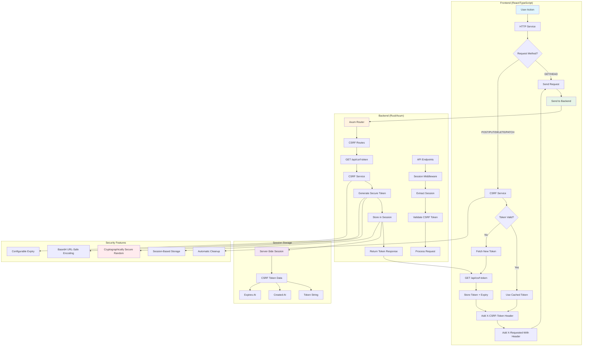

# CSRF Implementation Architecture

## Mermaid Diagram

## Component Relationships

### Frontend Components
- **CSRFService**: Singleton service managing token lifecycle
- **HTTPService**: Integrates CSRF headers for state-changing requests
- **Token Management**: Automatic refresh and validation

### Backend Components
- **CsrfService**: Core token generation and session management
- **CSRF Routes**: API endpoint for token retrieval
- **Session Integration**: Secure server-side token storage

### Security Flow
1. **Token Generation**: Cryptographically secure random token creation
2. **Session Storage**: Server-side storage with expiry management
3. **Header Injection**: Automatic CSRF header addition for protected requests
4. **Validation**: Server-side token verification for state-changing operations
