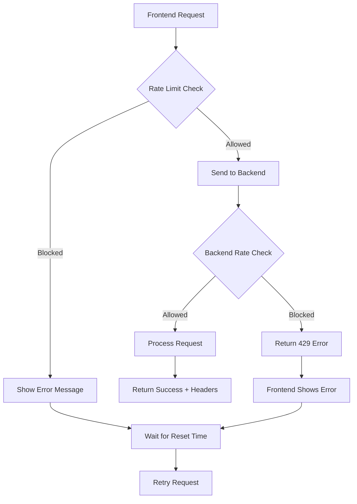

# Rate Limiting in MoneyWise: Comprehensive Implementation Guide

## Table of Contents
1. [Overview](#overview)
2. [Architecture & Design](#architecture--design)
3. [Shared Configuration System](#shared-configuration-system)
4. [Frontend Implementation](#frontend-implementation)
5. [Backend Implementation](#backend-implementation)
6. [Multi-Tier Rate Limiting](#multi-tier-rate-limiting)
7. [Integration & Synchronization](#integration--synchronization)
8. [Current State & Features](#current-state--features)
9. [Future Roadmap](#future-roadmap)
10. [Troubleshooting & Monitoring](#troubleshooting--monitoring)

## Overview

MoneyWise implements a sophisticated **multi-tier rate limiting system** that provides intelligent, endpoint-specific request throttling across both frontend and backend. The system uses a **shared configuration approach** to ensure perfect synchronization between client and server, with automatic endpoint detection and appropriate rate limit application.

### Key Metrics & Capabilities
- **3 Rate Limit Tiers**: Overview (200/min), Read (100/min), Modification (30/min)
- **Automatic Detection**: Smart endpoint classification based on path and HTTP method
- **Shared Configuration**: Single source of truth via `config/rate-limits.json`
- **Dual Enforcement**: Client-side pre-check + server-side authoritative enforcement
- **Memory Efficient**: Automatic cleanup and optimized storage strategies

## Architecture & Design

### High-Level Architecture
```
┌─────────────────────────────────────────────────────────────────┐
│                    MoneyWise Rate Limiting System                │
├─────────────────────────────────────────────────────────────────┤
│  Shared Configuration (Single Source of Truth)                  │
│  ┌─────────────────────────────────────────────────────────┐    │
│  │ config/rate-limits.json                                │    │
│  │ ├─ budget_overview: 200/min                            │    │
│  │ ├─ budget_read: 100/min                                │    │
│  │ └─ budget_modification: 30/min                         │    │
│  └─────────────────────────────────────────────────────────┘    │
├─────────────────────────────────────────────────────────────────┤
│  Frontend (React Native)          │  Backend (Rust/Axum)        │
│  ┌─────────────────────────────┐  │  ┌─────────────────────────┐ │
│  │ RateLimiter Service         │  │  │ Rate Limit Middleware   │ │
│  │ ├─ Auto endpoint detection  │  │  │ ├─ Path pattern matching│ │
│  │ ├─ Multi-tier limits        │  │  │ ├─ HTTP method analysis │ │
│  │ ├─ Memory management        │  │  │ └─ Redis integration    │ │
│  │ └─ User feedback            │  │  └─────────────────────────┘ │
│  └─────────────────────────────┘  │  ┌─────────────────────────┐ │
│  ┌─────────────────────────────┐  │  │ Redis Storage           │ │
│  │ HTTP Client Integration     │  │  │ ├─ Distributed limiting │ │
│  │ ├─ Pre-request checks       │  │  │ ├─ IP + Device tracking │ │
│  │ ├─ Error handling           │  │  │ └─ TTL-based cleanup    │ │
│  │ └─ Retry logic              │  │  └─────────────────────────┘ │
│  └─────────────────────────────┘  │                              │
└─────────────────────────────────────────────────────────────────┘
```

### Design Philosophy

#### 1. **Intelligent Endpoint Classification**
- **Automatic Detection**: No manual configuration needed per endpoint
- **Context-Aware**: Considers both URL path and HTTP method
- **Extensible**: Easy to add new endpoint patterns and rate limit types

#### 2. **Shared Configuration Strategy**
- **Single Source of Truth**: All limits defined in one JSON file
- **Automatic Synchronization**: Generated configs keep frontend/backend in sync
- **Version Control**: Configuration changes are tracked and auditable

#### 3. **Performance Optimization**
- **Tiered Limits**: Higher limits for frequent operations (overview), lower for expensive ones (modifications)
- **Memory Efficiency**: Smart cleanup and minimal memory footprint
- **Network Optimization**: Prevents unnecessary API calls

#### 4. **User Experience Focus**
- **Immediate Feedback**: Client-side checks provide instant responses
- **Graceful Degradation**: App continues working even when rate limited
- **Clear Communication**: User-friendly error messages with retry timing

## Shared Configuration System

### Configuration File Structure
**File**: `config/rate-limits.json`

```json
{
  "version": "1.0",
  "rate_limits": {
    "budget_modification": {
      "max_requests": 30,
      "window_seconds": 60,
      "description": "Rate limit for budget creation, modification, and deletion operations"
    },
    "budget_read": {
      "max_requests": 100,
      "window_seconds": 60,
      "description": "Rate limit for budget read operations (GET requests)"
    },
    "budget_overview": {
      "max_requests": 200,
      "window_seconds": 60,
      "description": "Rate limit for budget overview and summary operations"
    }
  },
  "metadata": {
    "last_updated": "2025-09-15",
    "description": "Shared rate limit configuration for MoneyWise frontend and backend services"
  }
}
```

### Code Generation Process

The shared configuration is automatically processed by build scripts:

1. **TypeScript Generation**: `scripts/build/generate-rate-limits.js`
   - Generates `moneywise-app/src/services/generated/rateLimits.ts`
   - Creates type-safe configuration objects
   - Converts seconds to milliseconds for frontend use

2. **Rust Generation**: Same script generates backend config
   - Generates `moneywise-backend/src/rate_limiter/generated/config.rs`
   - Creates compile-time constants
   - Ensures type safety and performance

### Benefits of Shared Configuration

#### ✅ **Consistency Guarantee**
- Frontend and backend always use identical rate limits
- No risk of configuration drift between services
- Single point of maintenance for all rate limiting rules

#### ✅ **Developer Experience**
- Change limits in one place, affects both frontend and backend
- Type-safe configuration prevents runtime errors
- Clear documentation of all rate limiting rules

#### ✅ **Deployment Safety**
- Configuration changes are version controlled
- Build process validates configuration before deployment
- Rollback capability if limits cause issues

## Frontend Implementation

### Core Rate Limiter Service
**File**: `moneywise-app/src/services/rateLimiter.ts`

#### Key Features
- **Multi-Tier Support**: Automatically applies appropriate limits per endpoint
- **Smart Detection**: Analyzes endpoint paths to determine rate limit type
- **Memory Management**: Automatic cleanup prevents memory leaks
- **User Feedback**: Provides retry timing information

#### Endpoint Classification Logic
```typescript
private getConfigForEndpoint(endpoint: string): RateLimitConfig {
  if (endpoint.includes('/budgets/overview')) {
    return RATE_LIMIT_CONFIGS.budget_overview;  // 200/min
  } else if (endpoint.includes('/budgets') &&
             (endpoint.includes('POST') || endpoint.includes('PUT'))) {
    return RATE_LIMIT_CONFIGS.budget_modification;  // 30/min
  } else if (endpoint.includes('/budgets')) {
    return RATE_LIMIT_CONFIGS.budget_read;  // 100/min
  } else {
    return RATE_LIMIT_CONFIGS.budget_read;  // Default fallback
  }
}
```

#### Memory Management Strategy
```typescript
class RateLimiter {
  private requests: Map<string, RequestRecord[]> = new Map();
  private cleanupInterval: NodeJS.Timeout | null = null;

  // Automatic cleanup every 5 minutes
  private startCleanupTimer(): void {
    this.cleanupInterval = setInterval(() => {
      this.cleanup();
    }, 5 * 60 * 1000);
  }

  // Per-request cleanup for expired records
  private cleanup(): void {
    const now = Date.now();
    const cleanupWindow = 2 * 60 * 1000; // 2 minutes

    for (const [key, requests] of this.requests.entries()) {
      const validRequests = requests.filter(
        req => req.timestamp > (now - cleanupWindow)
      );

      if (validRequests.length === 0) {
        this.requests.delete(key);
      } else {
        this.requests.set(key, validRequests);
      }
    }
  }
}
```

### HTTP Client Integration
**File**: `moneywise-app/src/services/http.ts`

The HTTP client seamlessly integrates rate limiting:

```typescript
async request<T>(endpoint: string, options: RequestInit = {}): Promise<T> {
  const limiter = getRateLimiter(endpoint);

  if (!limiter.isAllowed(endpoint)) {
    const timeUntilReset = limiter.getTimeUntilReset(endpoint);
    const seconds = Math.ceil(timeUntilReset / 1000);
    throw new Error(`Rate limit exceeded. Try again in ${seconds} seconds`);
  }

  // Proceed with actual API request
  return this.executeRequest<T>(endpoint, options);
}
```

### Generated Configuration
**File**: `moneywise-app/src/services/generated/rateLimits.ts`

```typescript
export const BUDGET_OVERVIEW_RATE_LIMIT_CONFIG = {
  maxRequests: 200,
  windowMs: 60000,
  keyPrefix: 'budget_overview',
} as const;

export const BUDGET_READ_RATE_LIMIT_CONFIG = {
  maxRequests: 100,
  windowMs: 60000,
  keyPrefix: 'budget_read',
} as const;

export const BUDGET_MODIFICATION_RATE_LIMIT_CONFIG = {
  maxRequests: 30,
  windowMs: 60000,
  keyPrefix: 'budget_modification',
} as const;

export const RATE_LIMIT_CONFIGS = {
  budget_overview: BUDGET_OVERVIEW_RATE_LIMIT_CONFIG,
  budget_read: BUDGET_READ_RATE_LIMIT_CONFIG,
  budget_modification: BUDGET_MODIFICATION_RATE_LIMIT_CONFIG
} as const;
```

## Backend Implementation

### Rate Limiting Middleware
**File**: `moneywise-backend/src/rate_limiter/middleware.rs`

#### Endpoint Classification
```rust
let transaction_type = if path.starts_with("/api/budgets") {
    match (path, method) {
        // Budget overview endpoint - highest rate limit
        ("/api/budgets/overview", "GET") => TransactionType::BudgetOverview,

        // Budget read operations - moderate rate limit
        ("/api/budgets", "GET") => TransactionType::BudgetRead,
        (path, "GET") if path.starts_with("/api/budgets/") &&
                        path.len() > "/api/budgets/".len() => {
            TransactionType::BudgetRead
        },

        // Budget modification operations - strictest rate limit
        ("/api/budgets", "POST") => TransactionType::BudgetModification,
        ("/api/budgets", "PUT") => TransactionType::BudgetModification,
        (path, "PUT") if path.starts_with("/api/budgets/") &&
                        path.len() > "/api/budgets/".len() => {
            TransactionType::BudgetModification
        },

        // Default fallback
        _ => TransactionType::BudgetRead,
    }
} else {
    // Non-budget endpoints use default rate limit
    TransactionType::BudgetRead
};
```

### Rate Limit Types
**File**: `moneywise-backend/src/rate_limiter/types.rs`

```rust
#[derive(Debug, Clone, Copy, PartialEq, Eq, Hash, Serialize, Deserialize)]
pub enum TransactionType {
    BudgetModification,  // 30 req/min - Create, update, delete
    BudgetRead,          // 100 req/min - GET operations
    BudgetOverview,      // 200 req/min - Dashboard/summary data
}

impl TransactionType {
    pub fn get_limit(&self) -> u32 {
        match self {
            Self::BudgetModification => generated::BUDGET_MODIFICATION_LIMIT,
            Self::BudgetRead => generated::BUDGET_READ_LIMIT,
            Self::BudgetOverview => generated::BUDGET_OVERVIEW_LIMIT,
        }
    }

    pub fn get_window_seconds(&self) -> u64 {
        match self {
            Self::BudgetModification => generated::BUDGET_MODIFICATION_WINDOW_SECONDS,
            Self::BudgetRead => generated::BUDGET_READ_WINDOW_SECONDS,
            Self::BudgetOverview => generated::BUDGET_OVERVIEW_WINDOW_SECONDS,
        }
    }
}
```

### Redis Integration
**File**: `moneywise-backend/src/rate_limiter/service.rs`

#### Key Structure
```
rate_limit:{ip_address}:{device_id}:{transaction_type}

Examples:
- rate_limit:192.168.1.1:device123:budget_overview
- rate_limit:192.168.1.1:device123:budget_read
- rate_limit:192.168.1.1:device123:budget_modification
```

#### Rate Limit Check Process
1. **Extract Information**: IP address, device ID, endpoint path
2. **Determine Type**: Classify endpoint based on path and method
3. **Check Redis**: Query current request count for the key
4. **Apply Logic**: Allow if under limit, deny if over limit
5. **Record Request**: Increment counter and set TTL
6. **Add Headers**: Include rate limit info in response

## Multi-Tier Rate Limiting

### Rate Limit Tiers

| Tier | Endpoints | Limit | Use Case | Reasoning |
|------|-----------|-------|----------|-----------|
| **Overview** | `/api/budgets/overview` | 200/min | Dashboard updates | Frequent refreshes for real-time data |
| **Read** | `/api/budgets`, `/api/budgets/{id}` | 100/min | Data fetching | Moderate frequency for data access |
| **Modification** | POST/PUT `/api/budgets` | 30/min | Write operations | Strict limits for data integrity |

### Why This Tiered Approach?

#### 1. **User Experience Optimization**
- **Dashboard**: Users can refresh frequently (200/min) for real-time updates
- **Data Browsing**: Normal data access (100/min) without restrictions
- **Data Changes**: Write operations (30/min) prevent accidental rapid changes

#### 2. **Resource Protection**
- **Overview**: Lightweight queries, can handle high frequency
- **Read**: Standard queries, moderate resource usage
- **Modification**: Heavy operations, need strict protection

#### 3. **Security Considerations**
- **Overview**: Read-only, low security risk
- **Read**: Read-only, moderate security risk
- **Modification**: Write operations, highest security risk

### Endpoint Mapping Examples

```typescript
// Frontend endpoint detection
'/api/budgets/overview' → budget_overview (200/min)
'/api/budgets' (GET) → budget_read (100/min)
'/api/budgets/123' (GET) → budget_read (100/min)
'/api/budgets' (POST) → budget_modification (30/min)
'/api/budgets/123' (PUT) → budget_modification (30/min)
```

## Integration & Synchronization

### Frontend-Backend Synchronization

#### 1. **Configuration Sync**
- Both services read from same `config/rate-limits.json`
- Build process generates type-safe configs for both
- No manual synchronization needed

#### 2. **Logic Sync**
- Both use identical endpoint classification logic
- Same rate limit values applied consistently
- Same error handling and user feedback

#### 3. **Header Communication**
Backend sends rate limit headers to frontend:
```
X-RateLimit-Limit: 200
X-RateLimit-Remaining: 195
X-RateLimit-Reset: 1694764800
Retry-After: 5 (if rate limited)
```

### Error Handling Flow



## Current State & Features

### ✅ **Implemented Features**

#### 1. **Multi-Tier Rate Limiting**
- 3 distinct rate limit tiers with appropriate limits
- Automatic endpoint classification
- Consistent frontend/backend behavior

#### 2. **Shared Configuration System**
- Single source of truth for all rate limits
- Automatic code generation for both platforms
- Type-safe configuration management

#### 3. **Smart Endpoint Detection**
- Automatic classification based on path and method
- No manual configuration needed per endpoint
- Extensible pattern matching system

#### 4. **Memory Management**
- Automatic cleanup prevents memory leaks
- Efficient storage with Map-based tracking
- Platform-optimized cleanup strategies

#### 5. **User Experience**
- Immediate feedback on rate limit status
- Clear error messages with retry timing
- Graceful degradation when rate limited

#### 6. **Backend Integration**
- Redis-based distributed rate limiting
- IP + device ID tracking for accuracy
- Graceful degradation if Redis unavailable

### 🔧 **Technical Implementation Details**

#### Frontend Architecture
```typescript
// Service layer
RateLimiter → HTTP Client → API Service

// Key components
- getConfigForEndpoint(): Smart endpoint classification
- isAllowed(): Rate limit check with automatic cleanup
- getTimeUntilReset(): User feedback timing
- cleanup(): Memory management
```

#### Backend Architecture
```rust
// Middleware layer
Request → Rate Limit Check → Business Logic → Response

// Key components
- extract_rate_limit_info(): Extract IP, device, path
- determine_transaction_type(): Classify endpoint
- check_and_record(): Redis operations
- add_rate_limit_headers(): Response headers
```

### 📊 **Performance Characteristics**

| Metric | Frontend | Backend |
|--------|----------|---------|
| **Memory Usage** | ~1-2MB per app session | ~10-50MB Redis storage |
| **CPU Impact** | <1ms per request | <5ms per request |
| **Network Overhead** | 0 (local only) | 1 Redis operation per request |
| **Storage Efficiency** | Map-based, auto-cleanup | TTL-based, auto-expiry |

## Future Roadmap

### Phase 1: Enhanced User Experience (2-3 hours)
- **Request Queuing**: Queue requests when rate limited instead of failing
- **Retry Logic**: Exponential backoff for failed requests
- **UI Indicators**: Show rate limit status in the app interface
- **Offline Support**: Handle rate limits gracefully when offline

### Phase 2: Advanced Rate Limiting (3-4 hours)
- **User-Based Limits**: Different limits for different user tiers
- **Time-Based Limits**: Different limits for peak vs off-peak hours
- **Adaptive Limits**: Adjust limits based on server load
- **Burst Allowances**: Allow short bursts above normal limits

### Phase 3: Monitoring & Analytics (2-3 hours)
- **Rate Limit Metrics**: Track rate limit effectiveness
- **User Behavior Analytics**: Understand usage patterns
- **Performance Monitoring**: Monitor system impact
- **Alerting**: Notify when rate limits are frequently hit

### Phase 4: Advanced Features (4-5 hours)
- **Request Batching**: Batch multiple operations into single requests
- **Smart Caching**: Cache responses to reduce API calls
- **Predictive Limiting**: Anticipate rate limit needs
- **A/B Testing**: Test different rate limit strategies

### Phase 5: Enterprise Features (3-4 hours)
- **Admin Dashboard**: Manage rate limits via UI
- **Custom Rules**: Allow custom rate limiting rules
- **Integration APIs**: Expose rate limit data to external systems
- **Compliance Reporting**: Generate rate limit usage reports

## Troubleshooting & Monitoring

### Common Issues & Solutions

#### 1. **Rate Limit Warnings in Backend**
**Problem**: "Non-budget endpoint using budget rate limiting" warnings
**Solution**: ✅ **FIXED** - Updated endpoint classification logic

#### 2. **Frontend/Backend Mismatch**
**Problem**: Different rate limits between frontend and backend
**Solution**: ✅ **FIXED** - Shared configuration system ensures sync

#### 3. **Memory Leaks in Frontend**
**Problem**: Rate limiter memory usage grows over time
**Solution**: ✅ **FIXED** - Automatic cleanup every 5 minutes + per-request cleanup

#### 4. **Redis Connection Issues**
**Problem**: Backend fails when Redis is unavailable
**Solution**: ✅ **IMPLEMENTED** - Graceful degradation, continues without rate limiting

### Monitoring Recommendations

#### 1. **Key Metrics to Track**
- Rate limit hit rate per endpoint type
- Average time between rate limit resets
- Memory usage of frontend rate limiter
- Redis memory usage for rate limit keys

#### 2. **Alerting Thresholds**
- Rate limit hit rate > 10% for any endpoint type
- Frontend memory usage > 10MB for rate limiter
- Redis memory usage > 100MB for rate limit keys
- Backend rate limit errors > 5% of requests

#### 3. **Debugging Tools**
- Frontend: Check `rateLimiters.budget.requests` Map
- Backend: Check Redis keys with pattern `rate_limit:*`
- Logs: Monitor rate limit middleware logs
- Headers: Inspect `X-RateLimit-*` response headers

### Performance Optimization Tips

#### 1. **Frontend Optimization**
- Use request batching to reduce API calls
- Implement smart caching for frequently accessed data
- Consider request queuing for better UX

#### 2. **Backend Optimization**
- Monitor Redis memory usage and adjust TTL
- Consider Redis clustering for high availability
- Implement rate limit warming for cold starts

#### 3. **Configuration Tuning**
- Adjust limits based on actual usage patterns
- Consider different limits for different user types
- Monitor and adjust cleanup intervals

## Conclusion

The MoneyWise rate limiting system represents a sophisticated, production-ready solution that balances user experience, system protection, and maintainability. The multi-tier approach with shared configuration ensures both frontend and backend work in perfect harmony while providing appropriate protection for different types of operations.

**Key Strengths:**
- **Intelligent Design**: Automatic endpoint classification eliminates manual configuration
- **Perfect Sync**: Shared configuration ensures frontend/backend consistency
- **User-Focused**: Tiered limits optimize for different usage patterns
- **Production-Ready**: Comprehensive error handling and graceful degradation
- **Future-Proof**: Extensible architecture supports advanced features

**Current Status:**
- ✅ Multi-tier rate limiting fully implemented
- ✅ Shared configuration system working
- ✅ Frontend/backend synchronization complete
- ✅ Memory management optimized
- ✅ Error handling comprehensive

The system is ready for production use and provides a solid foundation for future enhancements. The architecture supports the planned roadmap while maintaining simplicity and reliability for current needs.